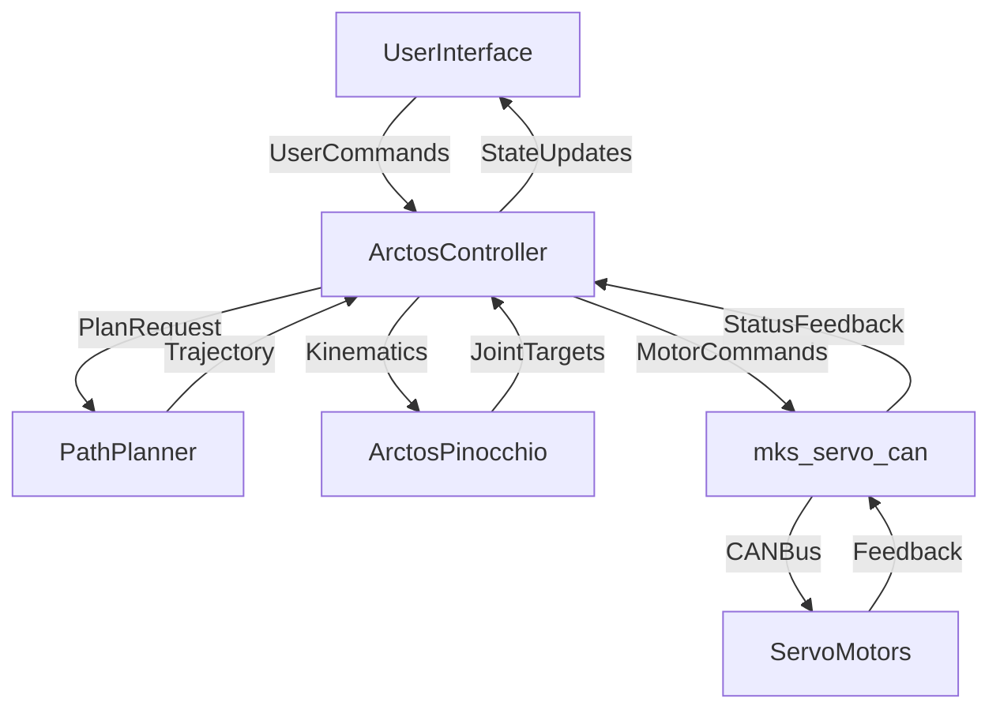

# Arctos Robot GUI Architecture

## Overview
The Arctos Robot GUI is a modular, extensible, and robust web-based control interface for the Arctos robot arm. Built with [NiceGUI](https://nicegui.io/) and Python, it enables real-time control, monitoring, and configuration of the robot through an intuitive browser interface. The architecture follows best practices for separation of concerns, scalability, and maintainability.

---

## Project Structure

```
ArctosGuiPython/
├── src/
│   ├── core/         # Core robot logic: control, kinematics, planning
│   ├── config/       # User and system configuration (YAML)
│   ├── models/       # 3D models (STL), URDFs
│   ├── services/     # Communication & hardware abstraction
│   ├── components/   # Reusable UI widgets (e.g., menu)
│   ├── pages/        # UI pages (home, control, settings, etc.)
│   ├── programs/     # Stored robot programs/trajectories
│   ├── utils/        # Utilities, settings manager
│   └── main.py       # Application entry point
├── docs/             # Documentation
├── requirements.txt  # Python dependencies
├── environment.yml   # Conda environment
└── ...
```

### Core (`src/core/`)
- **ArctosController.py**: High-level robot control, state machine, command dispatch
- **ArctosPinocchio.py**: Kinematics/dynamics with Pinocchio, robot model abstraction
- **PathPlanner.py**: Path and trajectory planning, interpolation
- **homing.py**: Homing/calibration procedures

### Services (`src/services/`)
- **mks_servo_can/**: CAN bus communication with MKS servos
  - `can_motor.py`, `can_commands.py`, `can_set.py`: Motor control, configuration, feedback
  - `mks_enums.py`, `mks_servo.py`: Device abstraction, enums

### UI Components (`src/components/`)
- **menu.py**: Navigation sidebar/menu
- _Future_: Buttons, sliders, status panels, etc.

### Pages (`src/pages/`)
- **home.py**: Landing/dashboard
- **control/**: Main robot control UI (split into submodules: joint, Cartesian, gripper, path planning, visualization, etc.)
- **settings/**: Application and hardware settings (modularized)
- **mks_config.py**: Servo/motor configuration UI

### Utils (`src/utils/`)
- **settings_manager.py**: Persistent settings/configuration handler
- **utils.py**: Math, conversions, keyboard handlers, helpers

### Models (`src/models/`)
- **meshes/**: STL files for 3D visualization
- **urdf/**: Robot URDF(s) for kinematic model

### Config (`src/config/`)
- **mks_settings.yaml**: Motor/servo configuration
- **user_config.yaml**: User preferences

### Programs (`src/programs/`)
- **Test.json**: Example stored motion program

---

## Key Features

### 1. Robot Control
- Joint and Cartesian position control (direct and via path planner)
- Path planning and trajectory execution
- Gripper/end-effector control
- Homing and calibration routines

### 2. User Interface
- Real-time joint and Cartesian state feedback
- 3D visualization (MeshCat integration)
- Interactive controls: sliders, buttons, keyboard shortcuts
- Status console and notifications
- Modular, extensible page/component structure

### 3. Safety & Validation
- Joint limit checking (software)
- Movement validation (trajectory and command level)
- Emergency stop (hardware and UI-triggered)
- Error/status reporting throughout stack

---

## Communication & Data Flow



- **UI**: Sends user commands (move, stop, plan, home, etc.)
- **Controller**: Central logic, orchestrates planning, kinematics, and hardware
- **PathPlanner**: Generates valid trajectories
- **Kinematics**: Computes joint/Cartesian conversions
- **CAN Service**: Hardware abstraction, real-time feedback
- **UI**: Receives feedback, updates visualization and state

---

## Extensibility & Best Practices

- **Modularization**: Each logical domain (control, planning, UI, hardware) is isolated for testability and extensibility.
- **Configuration**: All user and hardware settings are YAML-based and managed via `settings_manager.py`.
- **UI Components**: Designed for reuse and easy extension (add new controls/pages without core changes).
- **Hardware Abstraction**: CAN communication is fully abstracted for portability to other motor drivers.
- **Error Handling**: Logging and error reporting at all critical points.
- **3D Visualization**: MeshCat and STL/URDF models are decoupled from control logic for flexibility.
- **Safety**: Emergency stop, joint limits, and validation are enforced at both UI and controller levels.

---

## Dependencies

- **NiceGUI**: Modern Python web UI framework
- **Pinocchio**: Fast kinematics/dynamics for robotics
- **python-can**: CAN bus communication
- **MeshCat**: 3D visualization
- **PyYAML**: Configuration loading
- **Logging**: Built-in for diagnostics

---

## Configuration & Customization
- All settings (theme, CAN port, joint limits, etc.) are loaded from YAML and can be changed via the UI.
- Adding new robot models: Place STL/URDF files in `src/models/` and update configuration accordingly.
- Extending UI: Add new components/pages under `src/components/` and `src/pages/`.

---

## License & Credits
- Main project: MIT License
- MKS Servo CAN library: GPLv3
- See README.md for credits and external resources.
